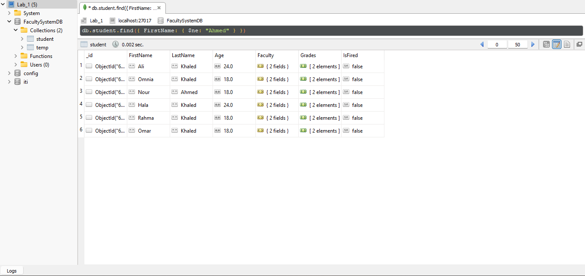

# MongoDB-ITI-Intake44

## Q3. Insert 3 (at least) documents in Student collection with different values.

**1. Try inserting one record each time**

**2. Try inserting many students using one insert statement.**

## Q4. Retrieve the following data:

    **1. All Students.**

    **2. Student with specific First Name.**

    **3. Students who his First Name=Ahmed, or Last Name= Ahmed.**

\*\*4. Students that their First name isn't "Ahmed".

    **5. Students with Age more than or equal to 21, and their faculty isn't NULL.**

    **6. Display student with specific First Name, and display his First Name,Last name, IsFired fields only.**

## Q5. Update the student with specific FirstName, and change his LastName.

## Q6. Delete Fired students.

## Q7. Delete all students collection.

## Q8. Delete the whole DB.
