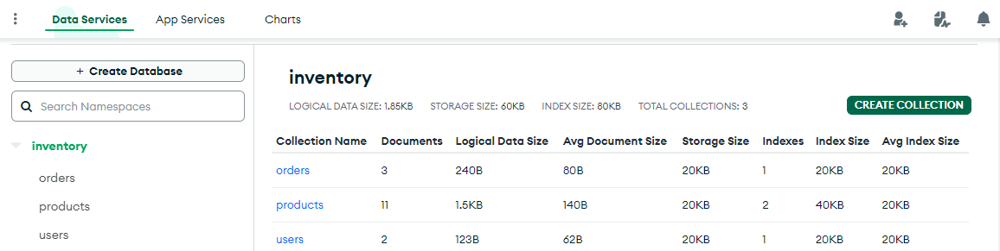
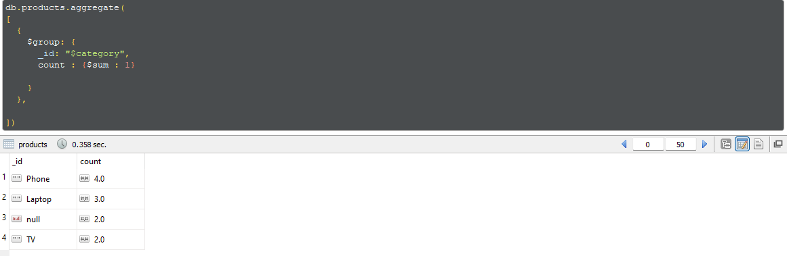
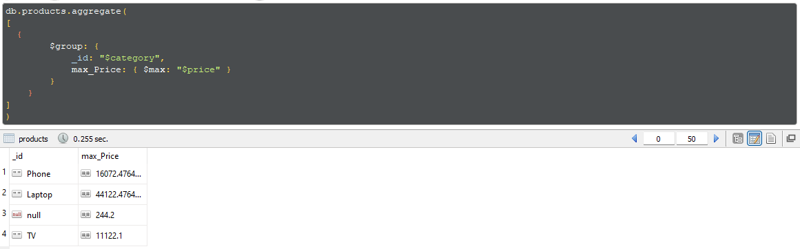

# MongoDB-ITI-Intake44 Lab 2

A) inventory Database.

   1. Import inventory database.

   2. Display number of products per category.

   3. Display max category products price.

   4. Display user ahmed orders populated with product.
   5. Get user ahemd highest order price

B) Library Database using books.json

  1. import books.json.

- Running aggregation queries that use multiple stages ($match, $group, $count, $skip, $limit, $lookup, $sortByCount etc).

- Using $project and $addFields with operator expressions such as ($getField, $first, $concat, $dateToString, $arrayElemAt etc).

- Using $unwind.

